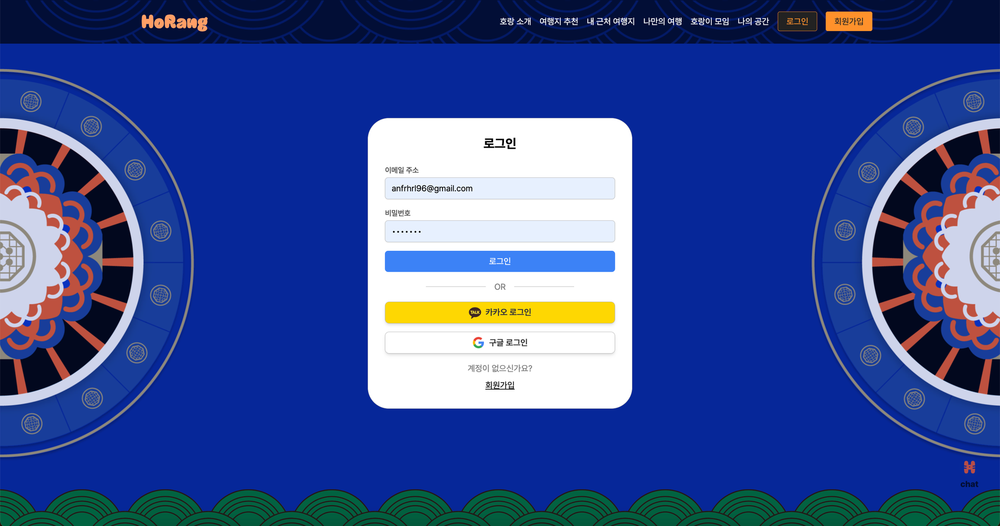

# Horang

- 🔗 [사이트](https://horang2.vercel.app/)
- 🔗 [브로셔](https://react5thbrochure.oopy.io/0e2b4a9a-e5a7-4491-b2db-91413d002ccb)

  

## 팀원

|                                                                                                안종현                                                                                                |                                                                                               서예은                                                                                                |                                                                                                양대우                                                                                                 |                                                                                             김지환                                                                                              |                                                                                             김운성                                                                                              |                                                                                                                          이지원                                                                                                                          |
| :--------------------------------------------------------------------------------------------------------------------------------------------------------------------------------------------------: | :-------------------------------------------------------------------------------------------------------------------------------------------------------------------------------------------------: | :---------------------------------------------------------------------------------------------------------------------------------------------------------------------------------------------------: | :---------------------------------------------------------------------------------------------------------------------------------------------------------------------------------------------: | :---------------------------------------------------------------------------------------------------------------------------------------------------------------------------------------------: | :------------------------------------------------------------------------------------------------------------------------------------------------------------------------------------------------------------------------------------------------------: |
| 

 | 

 | 

 | 

 | 

 | 

 |
|                                                                                                 리더                                                                                                 |                                                                                               부리더                                                                                                |                                                                                                 팀원                                                                                                  |                                                                                              팀원                                                                                               |                                                                                              팀원                                                                                               |                                                                                                                         디자이너                                                                                                                         |
|                                                                          [Ahnjonghyun87](https://github.com/Ahnjonghyun87)                                                                           |                                                                           [yeeunseo-dev](https://github.com/yeeunseo-dev)                                                                           |                                                                          [DAEWOOYANG0310](https://github.com/DAEWOOYANG0310)                                                                          |                                                                             [RingKim1](https://github.com/RingKim1)                                                                             |                                                                             [host2024](https://github.com/host2024)                                                                             |                                                                                                                        [이지원]()                                                                                                                        |

  

## 프로젝트 소개

## 국내 여행 소개, 내 취향 여행지 추천 및 여행객 소통의 장 **“호랑”**

- 여행지, 숙소, 음식점과 축제 및 행사 등 다양한 **국내 여행 정보 제공 플랫폼**
- 사용자의 **여행 MBTI 유형**을 나눠 사용자의 취향을 고려한 **맞춤형 추천 서비스 제공**
- 호랑 여행객을 위한 **커뮤니티, 채팅 기능**을 통해 소통의 장 제공

  

## 🏗️아키텍쳐

  

## 화면구성 및 주요 기능

### 로그인 / 회원가입

- **호랑**은 기본적인 국내 여행 정보를 제공하지만 **내 근처 여행지, 나만의 여행 등** 맞춤형 여행 정보 제공을 위해 **로그인 기능이 필요**합니다.
- 기본적인 **이메일 주소로 가입** 할 수 있으며, 구글, 카카오 등 **소셜 로그인 기능도 지원**합니다.
<table style="width: 100%; border-collapse: collapse;">
    <tr>
        <td style="text-align: center;">
            <h3>로그인</h3>
            
        </td>
        <td style="text-align: center;">
            <h3>회원가입</h3>
            
        </td>
    </tr>
</table>

### 메인페이지, 여행지 추천

### 상세 페이지

- 해당 장소의 **자세한 정보**를 볼 수 있습니다,
- **좋아요 / 취소 기능**이 있습니다
- 소셜 공유 아이콘을 클릭하면 url 복사와 카카오톡 **소셜 공유가 가능**합니다
- 해당 장소에 대한 **상세한 위치**를 카카오 맵으로 제공하고 마커로 표시합니다.
- 여행객이 해당 장소에 대해 리뷰를 남길 수 있도록 **댓글 기능**을 지원합니다.

### 내 근처 여행지

### 나만의 여행

### 호랑이 모임

### 나의 공간

### 대화하기

  
